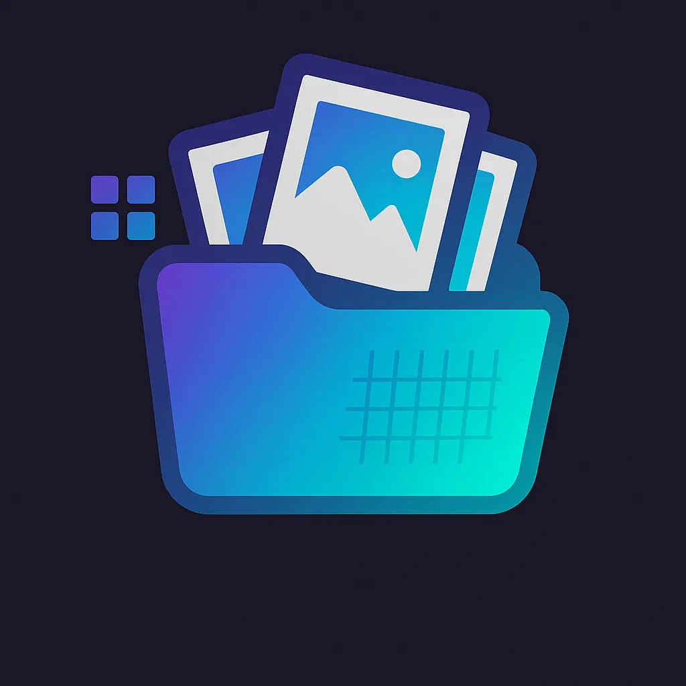
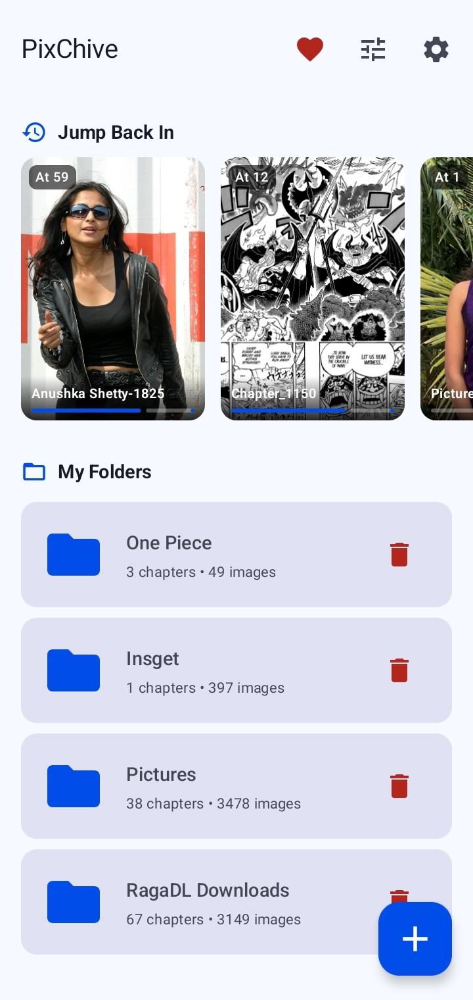
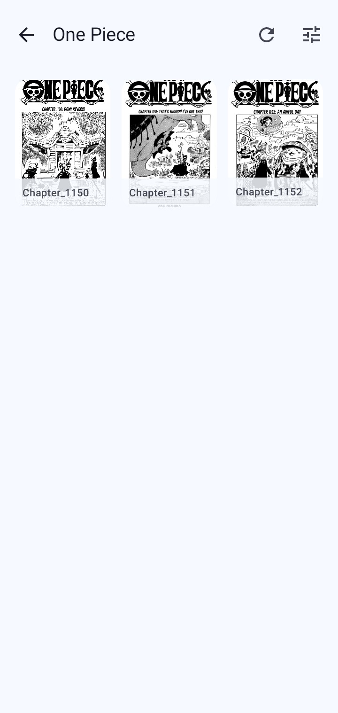
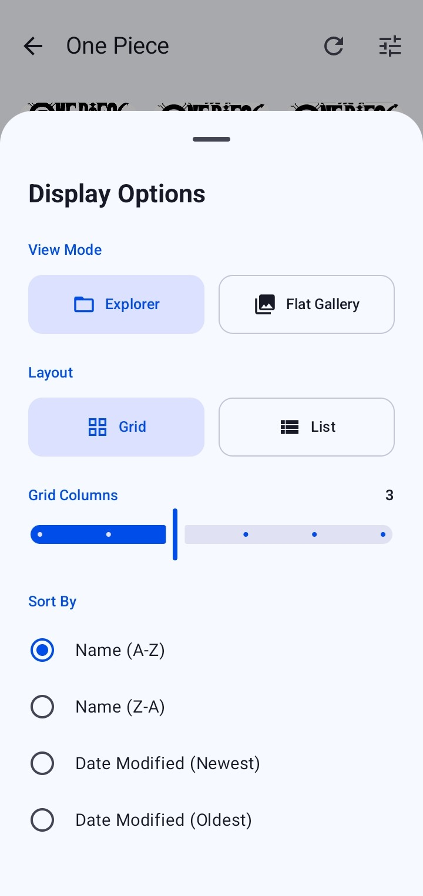
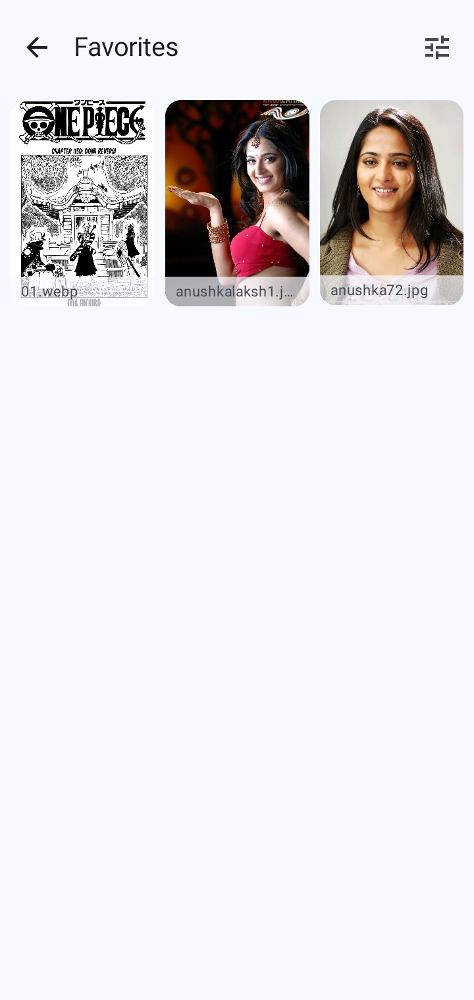
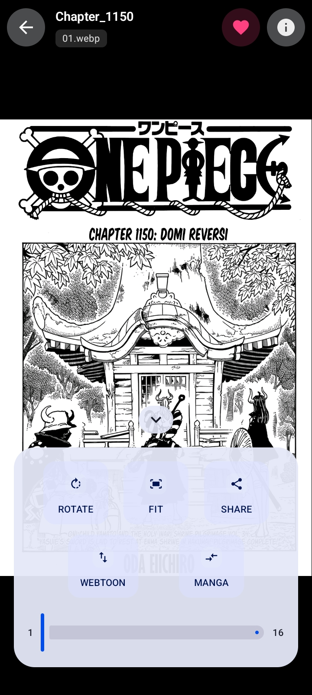
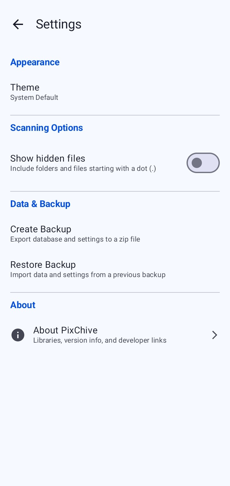

<div align="center">



# PixChive

### Native Android Gallery App

[](https://github.com/DevSon1024/PixChive/releases/latest)
[](https://github.com/DevSon1024/PixChive/releases)
[](LICENSE)

## Download

[](https://github.com/DevSon1024/PixChive/releases)

## _Requires Android 8.0 or higher._

## 📱 Screenshots

<div align="center">







</div>
</div>

---

PixChive is an Android image gallery and comic reader app that I'm building to make viewing large folders of images or manga chapters as seamless as possible.

My main focus is on creating a clean, fast experience that works completely offline with your locally stored images. If you read a lot of downloaded comics or manga chapter by chapter, or just want a lightweight and private way to browse a personal image archive, this app is designed for you.

## Features

- Browse your images organized by folders.
- Dedicated reading mode optimized for comics and manga.
- Support for reading local files directly from your device storage.
- A fast, mobile-first interface built with Jetpack Compose.
- Smooth swipe navigation between pages.
- Webtoon-style vertical scrolling mode alongside standard pagination.
- Reading directions tailored for Manga (Right-To-Left).

## Tech Stack

The app is built natively for Android using Kotlin and Jetpack Compose. It follows an MVVM architecture and relies on Android's MediaStore and File APIs to handle local files efficiently.

_Note: The project is actively being developed and is part of a learning journey, so expect frequent updates and structural changes._

## Roadmap

Here are some of the things I'm currently working on or planning to add:

- Grid and list view toggling
- Better image caching and generating thumbnails
- Showing your reading progress within a chapter
- Automatically resuming your read from the last viewed page
- Bookmarking specific folders
- A fully immersive full-screen reading mode
- Refining the pinch-to-zoom interactions
- Adding more sorting options (by name, size, date)

## How to build and run

If you want to try it out or poke around the code:

1. Clone this repository:
   ```bash
   git clone https://github.com/DevSon1024/PixChive.git
   ```
2. Open the project in Android Studio.
3. Let Gradle sync the project files.
4. Run the app on your emulator or connected physical Android device.

## Contributing

If you're interested in helping improve PixChive, contributions are definitely welcome. Feel free to fork the repository, make your changes on a new branch, and open a pull request.

## License

This project is open-source and licensed under the GNU General Public License v3.0. You can check out the `LICENSE` file for more details.

## Author

Created by Devson.

You can find me on GitHub at [@DevSon1024](https://github.com/DevSon1024). If you find this project useful, I'd appreciate a star on the repo or any feedback you might have!
